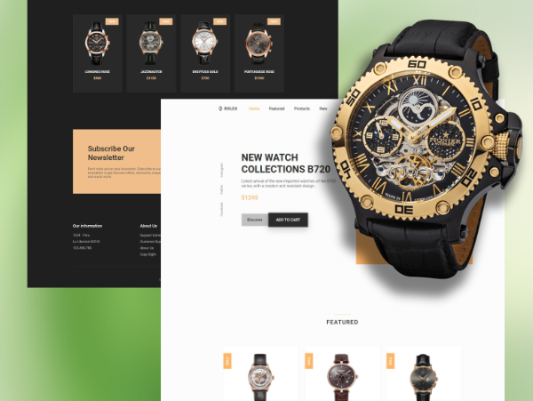

# ⌚ Watches Website 

# Título do Projeto

Este é um exemplo de README.md para um projeto de website que inclui um menu responsivo, carrosséis de testemunhos e produtos, temas de luz e escuro, e funcionalidades adicionais.

## Índice

- [Sobre](#sobre)
- [Recursos](#recursos)
- [Demonstração](#demonstração)
- [Instalação](#instalação)
- [Uso](#uso)
- [Contribuindo](#contribuindo)
- [Autor](#autor)
- [Licença](#licença)

## Sobre

Este projeto é um website responsivo que inclui um menu de navegação, carrosséis de testemunhos e produtos, um tema de luz e escuro, e funcionalidades adicionais, como ativação de links conforme a rolagem e um botão de retorno ao topo.

## Recursos

- Menu de navegação responsivo.
- Carrossel de testemunhos com botões de navegação.
- Carrossel de produtos com respostas a diferentes tamanhos de tela.
- Tema de luz e escuro com um botão de alternância.
- Ativação de links de navegação conforme a rolagem.
- Botão de retorno ao topo.

## Demonstração

Adicione capturas de tela, GIFs ou links para uma demonstração do projeto.

## Instalação

1. Clone o repositório: `git clone https://github.com/euramondiaz/ecommerce-clock`
2. Navegue até o diretório do projeto: `cd nome-do-repositorio`
3. Abra o arquivo `index.html` em um navegador da web.

## Uso

Após a instalação, o projeto pode ser acessado localmente em um navegador da web. O menu de navegação pode ser acionado clicando no ícone de menu no canto superior direito. Os carrosséis podem ser navegados usando os botões de seta ou arrastando os slides. O tema de luz e escuro pode ser alternado clicando no botão correspondente no canto superior direito.

## Contribuindo

Contribuições são bem-vindas! Para contribuir com este projeto, siga estas etapas:

1. Faça um fork do projeto.
2. Crie uma branch para sua modificação: `git checkout -b feature/nova-funcionalidade`
3. Faça commit das suas alterações: `git commit -am 'Adicionar nova funcionalidade'`
4. Envie a sua branch: `git push origin feature/nova-funcionalidade`
5. Faça um pull request para a branch principal.

Por favor, certifique-se de atualizar os testes conforme apropriado.

## Autor

Este projeto foi desenvolvido por [RAMON DIAS](https://github.com/euramondiaz).

## Licença

Este projeto é licenciado sob a Licença MIT. Consulte o arquivo [LICENSE](LICENSE) para obter mais detalhes.

